# Practica Docker José Antonio Pérez Alías

# tarea 1 Creando imágenes
## Paso 1
Ejecuta un contenedor basado en la imagen:
Ubuntu
```
docker run ubuntu 
```

 
 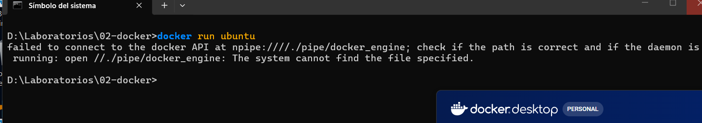


El clásico error de Docker. Lo que está pasando aquí es muy sencillo: la terminal (el cliente de Docker) está intentando hablar con el "motor" de Docker (el daemon), pero este está completamente apagado. Es como intentar arrancar el coche sin haberle puesto la batería.

Para solucionarlo, solo debes seguir estos pasos:

1. Inicia Docker Desktop
Busca Docker Desktop en tu menú de inicio de Windows y ejecútalo.
 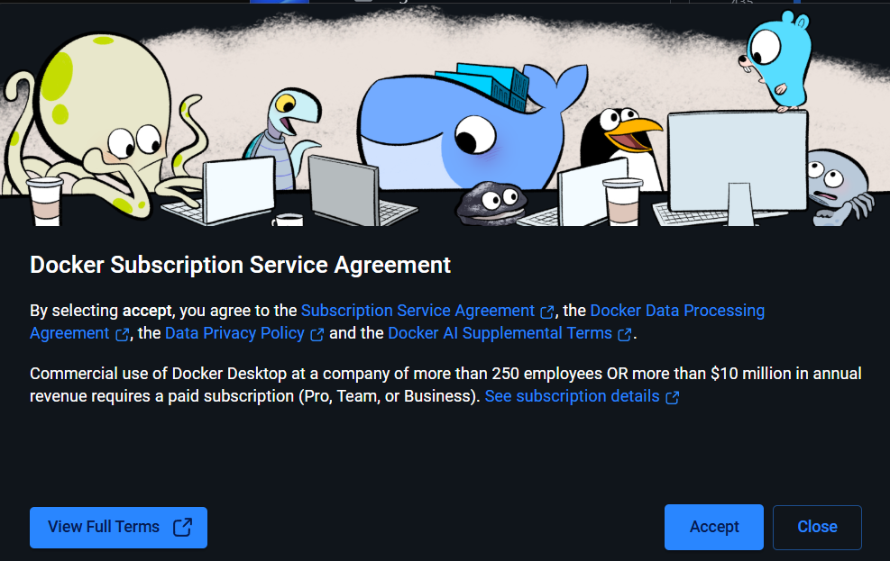
 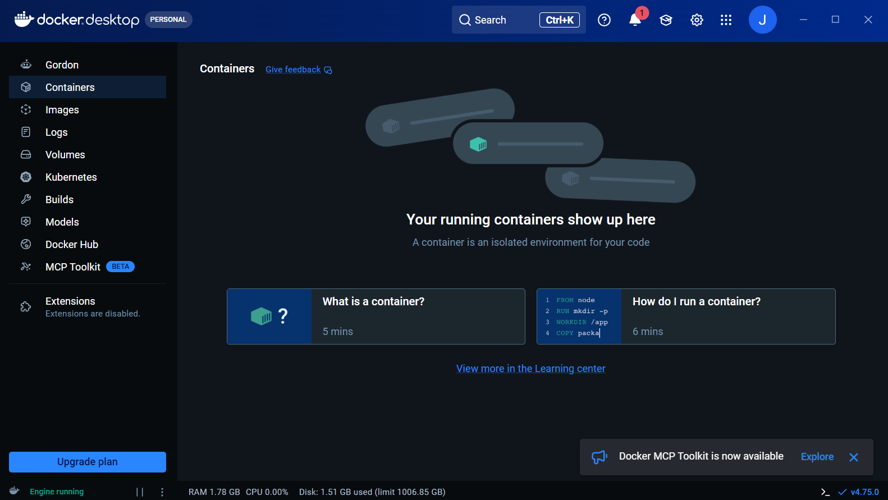


3. Vuelve a probar en tu CMD
Una vez que Docker Desktop esté listo, regresa a tu consola (donde tienes la carpeta 02-docker) y vuelve a ejecutar tu comando:
 


Accede a la terminal del contenedor.
Ejecucion interactiva

```
docker run -it ubuntu 
```

Instala curl:
```
apt-get update
```

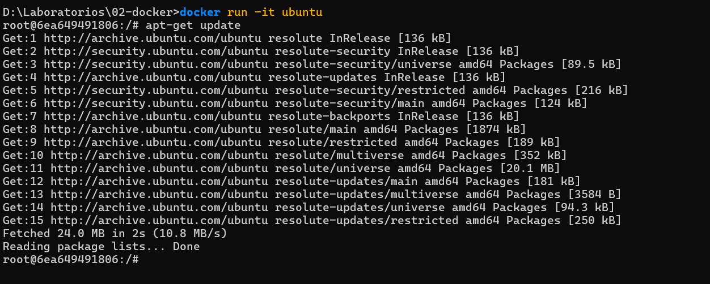

```
apt-get install curl
```

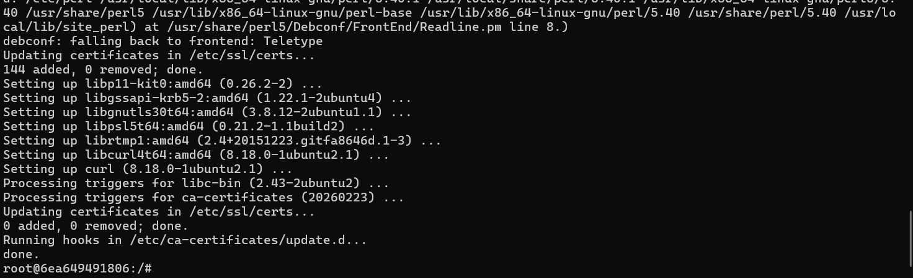
 
Comprueba que funciona:
curl --version

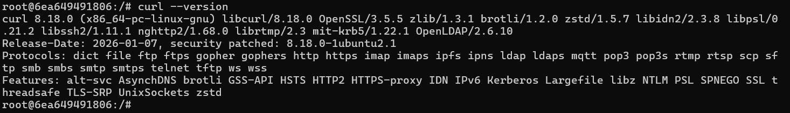

 

## Pregunta  ¿Con qué comando podrías guardar los cambios del contenedor como una nueva imagen?

**Opción A: Dejar el contenedor abierto (Recomendado)**
Si quieres seguir haciendo cosas dentro de Ubuntu después de guardar la imagen, no te salgas.
Abre una **nueva ventana de CMD** en Windows (así tendrás dos: una con Ubuntu y otra en Windows).
En esa nueva ventana, ejecuta el comando usando el ID 6ea649491806, que aparece en root@6ea649491806 

```
docker commit 6ea649491806 mi_ubuntu_personalizado:v1
```

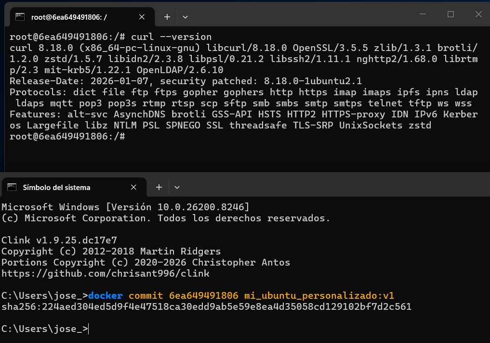


NOTA: al  guardar el contenedor mientras está encendido, Docker pausará el contenedor durante un milisegundo de forma automática para asegurar que no se corrompa ningún archivo mientras toma la "foto", y luego lo dejará seguir funcionando como si nada. 


## Paso 2 --- Dockerfile
Crea un Dockerfile que haga lo mismo automáticamente.

****Crea el archivo:**** Dentro de tu carpeta, crea un archivo de texto nuevo, pégale el código de siguiente y guárdalo eliminando la extensión .txt. Debe llamarse Dockerfile (así, a secas, con la D mayúscula y sin extensiones).

```
# 1. Usar la imagen oficial de Ubuntu como base
FROM ubuntu:latest

# 2. Actualizar los repositorios e instalar curl sin interactuar (el -y evita que pregunte)
RUN apt-get update && apt-get install -y curl

# 3. Opcional: Definir el comando por defecto al iniciar el contenedor
CMD ["/bin/bash"]
```


***Construye la imagen (Build):*** Abre tu CMD de Windows ejecuta el comando :
```
docker build -t mi-ubuntu-curl .
```

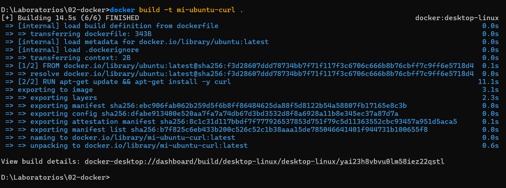


Comprueba el resultado (Run): Una vez termine el proceso (verás que se parece mucho a tu primera captura de pantalla), arranca el contenedor con el comando de tu segunda imagen: 

```
docker run -it mi-ubuntu-curl
````


***Verificación final:*** Una vez dentro del contenedor (root@...:/#), escribe curl --version 
```
 curl --version 
````

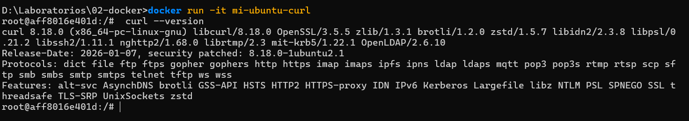


## Pregunta ¿Qué comando permite ver las capas de una imagen Docker?
El comando clásico e ideal para ver las capas de una imagen Docker es 
````
docker history.
````

Este comando te muestra un historial detallado de cómo se construyó la imagen, listando cada una de las capas creadas por las instrucciones de su Dockerfile (como FROM, RUN, COPY, etc.), el tamaño que ocupa cada capa en el disco y el comando que la originó.


Ejemplo:
```
docker history mi-ubuntu-curl 
```

Esto te muestra todas las capas que forman la imagen, incluyendo los comandos usados para crearlas.
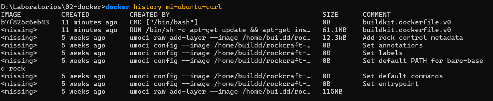


<br>
<br>
---

# tarea 2. Limpiando imágenes (opcional)
## Crea un Dockerfile basado en:
ubuntu

 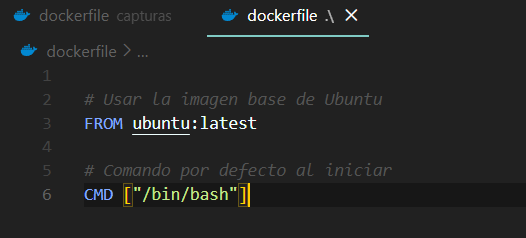

Para crear la imagen uso el siguiente comando
```
docker build -f dockerfile-ubuntu -t mi-ubuntu-base .
```
 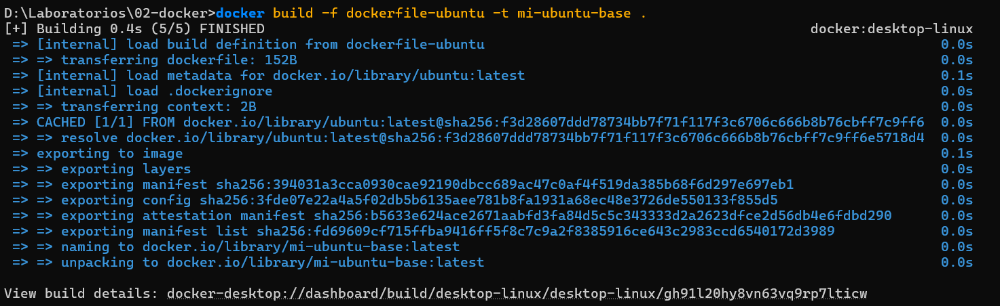


## 2 Después modifica el Dockerfile para instalar curl


```
FROM ubuntu
RUN apt-get update && apt-get install -y curl

```

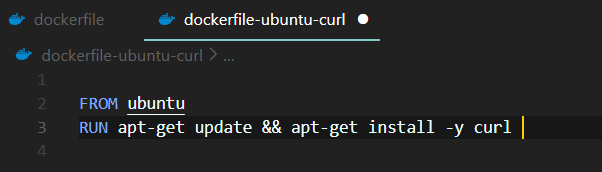

para crear la imagen ejecuto el comando
```
docker build -f dockerfile-ubuntu-curl -t mi-ubuntu-curl .
```

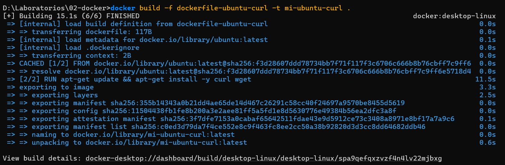


## 3 Después modifica el Dockerfile para instalar wget
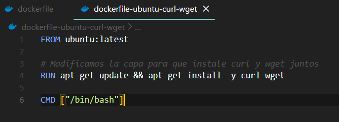

Con el nuevo dockerfile construimos la nueva imagen
````
docker build -f dockerfile-ubuntu-curl-wget -t mi-ubuntu-wget .
````


## 3 Construye la imagen en cada cambio.

## 4 Lista las imágenes:
```
docker images
```

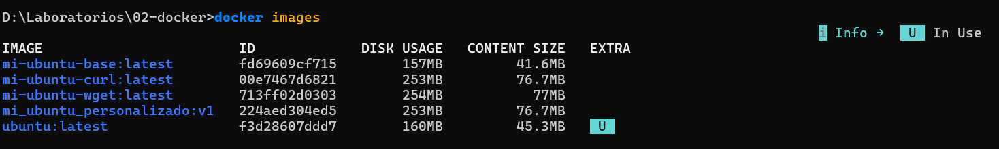
 
## Pregunta: ¿Qué ocurre con las imágenes anteriores?
En Docker, una imagen es una pila de capas de solo lectura. Cada línea de Dockerfile crea una capa nueva.

Cuando modifiqué el archivo para crear mi-ubuntu-wget, el motor usó el mecanismo de Layer Caching (Caché de Capas): detectó que las capas de Ubuntu y curl ya existían, no las volvió a descargar, y solo calculó el delta (la diferencia) añadiendo los binarios de wget en una capa superior. Las imágenes anteriores no se borran; comparten la misma base.


***2. Diferencia: Content Size vs. Disk Usage***

****CONTENT SIZE (Tamaño Virtual):**** Es el peso lógico total de la imagen si estuviera completamente sola. Suma el peso de todas sus capas desde la base hasta la punta ($\text{Ubuntu} + \text{curl} + \text{wget}$). Te dice cuánto pesará si la subes a internet o la llevas a otra máquina.

***DISK USAGE (Espacio Físico Real):**** Es el espacio que la imagen ocupa físicamente en tu disco duro. Gracias a la estrategia Copy-on-Write (Copia en Escritura), Docker no duplica los archivos comunes en tu disco.

***En resumen:*** Aunque ambas imágenes tengan un Content Size de unos 77 MB, el impacto real en tu disco duro al crear la última imagen fue de solo 0.3 MB, porque todo lo demás ya estaba almacenado y se reutilizó.


# tarea 3 Volúmenes persistentes

## 1. Ejecuta un contenedor de   postgres
Usa un volumen Docker montado en:  /var/lib/postgresql/data


Creo el contenedor con la imagen postgres

***ATENCION*** 

Aunque a partir de PostgreSQL 18 la estructura interna del motor cambie, la imagen oficial de Docker de Postgres sigue necesitando obligatoriamente que el volumen apunte a la carpeta exacta donde se inicializa la base de datos (/var/lib/postgresql/data).
Si apuntas el volumen a la raíz /var/lib/postgresql, el script de inicio de la imagen de Docker fallará porque intentará crear archivos de configuración en una ruta donde el volumen bloquea los permisos, o bien no encontrará la subcarpeta data preconfigurada en las variables de entorno de la imagen.


```
docker run -d --name postgres-ejercicio-3 -e POSTGRES_PASSWORD=dragon --mount source=postgres-data,target=/var/lib/postgresql/data postgres
```
listar volumen

```
docker volume ls
```
inspeccionar detalles tecnicos

```
docker volume inspect postgres-data
```

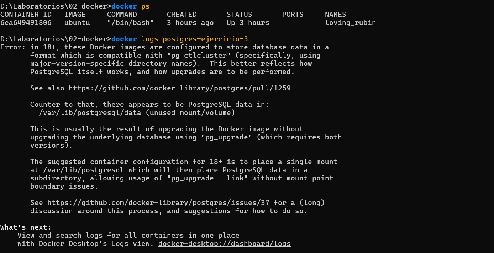


## 2. Conéctate a la base de datos y Crear tabla la siguiente tabla 

Antes de entrar hay que asegurarse que esté en ejecución


pues parece que esta mal creada y hay que eliminarla
y borrar el volumen, por si acaso

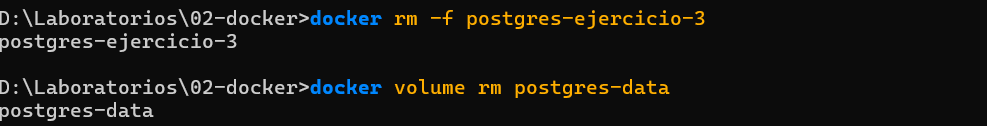

volver a lanzar comando
```
docker run -d --name postgres-ejercicio-3 -e POSTGRES_PASSWORD=dragon --mount source=postgres-data,target=/var/lib/postgresql postgres
```

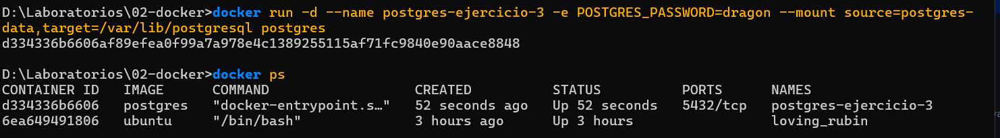

Entramos en el contenedor
```
docker exec -it postgres-ejercicio-3 psql -U postgres
```

Crea la tabla:

```sql
CREATE TABLE items (
 id SERIAL PRIMARY KEY,
 name TEXT
);
```

## 3.Inserta un registro:

```
INSERT INTO items(name) VALUES ('item1');
```


Comprobación con un select 
```
SELECT * FROM items;
```

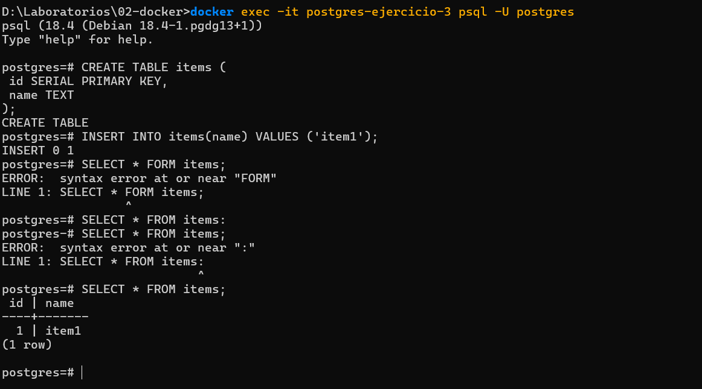


## 4. Stop 
Para el contenedor y Elimina el contenedor
```
docker stop postgres
docker rm postgres
```


###  nuevo contenedor
Crea un nuevo contenedor usando el mismo volumen y Comprueba que los datos siguen existiendo. Le cambiamos de nombre pero apunta al mismo volumen
```
docker run -d --name postgres-nuevo -e POSTGRES_PASSWORD=dragon --mount source=postgres-data,target=/var/lib/postgresql postgres
````

Vuelvo a conectar
```
docker exec -it postgres-nuevo psql -U postgres
````

ejecuto sql y compruebo un item de antes 
SELECT * FROM items;

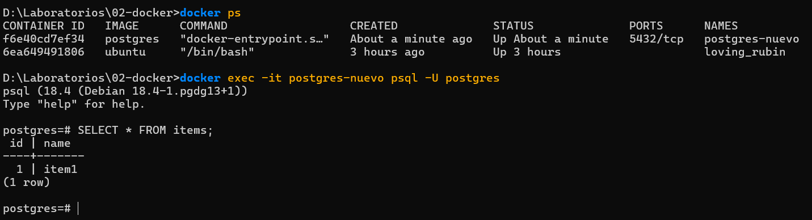


# tarea 4 Volúmenes persistentes Bind mounts 

## Crea un archivo en tu máquina: 

index.html
Ejemplo:
<h1>Hola Docker, soy JOSE ANTONO</h1>

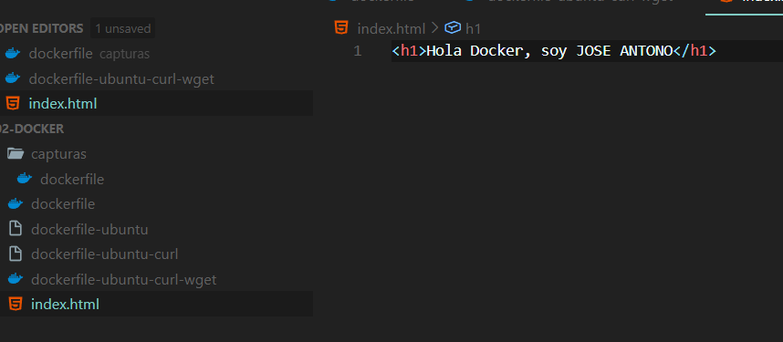

 
# Ejecuta un contenedor nginx:
mapea el puerto ***80 ***
monta el archivo en:
/usr/share/nginx/html/index.html

Para hacer esto ejecuto el siguiente comando:
```
docker run -d --name nginx-ejercicio-4 --mount type=bind,source=D:\Laboratorios\02-docker\index.html,target=/usr/share/nginx/html/index.html -p 8080:80 nginx

```

Me pide permisos el firewall de windows

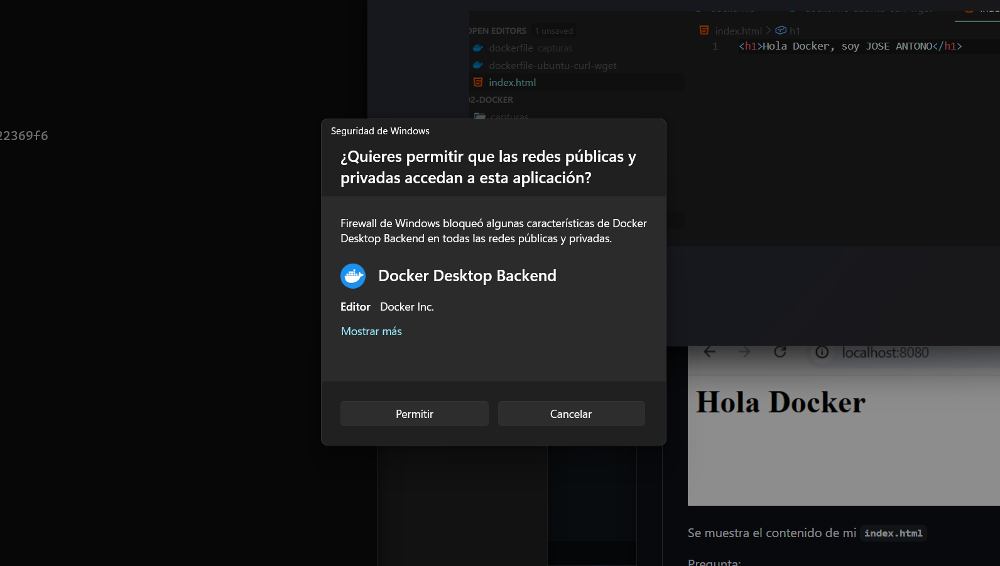


Contenedor creado y funcionando
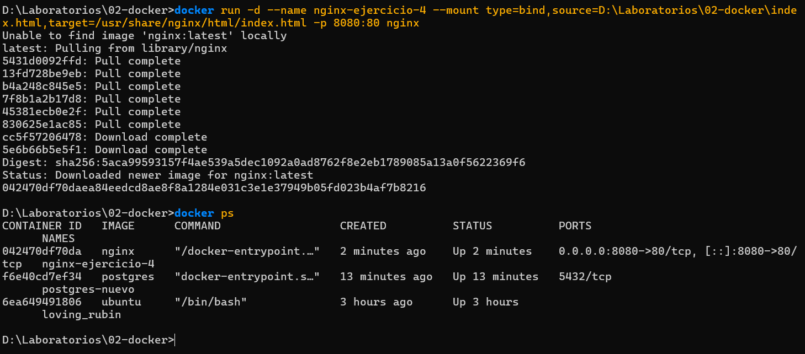

Visualmente algo falla, no aparece el texto
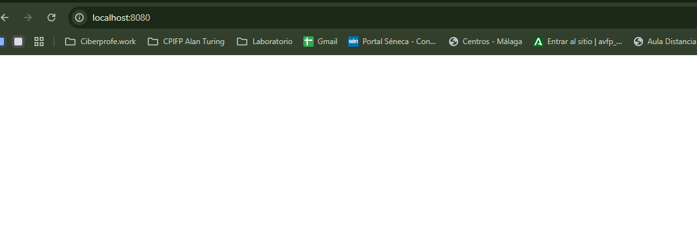


El fichero index.html estaba creado en visual studio code, pero NO estaba grabado!
Ahora si
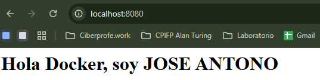
 
# Abre el navegador.
http://localhost/index.html

#Pregunta:  
¿Qué ocurre si modificas el archivo index.html en tu máquina?
Que si cambio index.html, lo guardo, y actualizo la pagina o la vuelvo a cargar, cogerá la nueva configuracion

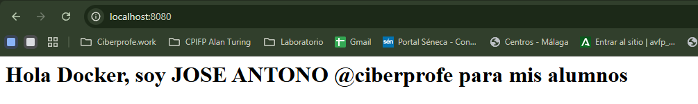


# tarea 5. Auditando volúmenes (opcional) 
# Investiga: ¿Qué comando permite ver dónde guarda Docker los datos de un volumen?

El comando es: docker volume inspect <nombre_volumen>
En Nuestro caso 
```
docker volume inspect postgres-data
````
Verás algo así:
```
[
    {
        "CreatedAt": "2026-05-29T10:22:51Z",
        "Driver": "local",
        "Labels": null,
        "Mountpoint": "/var/lib/docker/volumes/postgres-data/_data",
        "Name": "postgres-data",
        "Options": null,
        "Scope": "local"
    }
]

```
⚠️ Una nota muy importante si estás usando Windows
Como estás trabajando en la ruta D:\Laboratorios\02-docker, estás utilizando Docker Desktop en Windows (probablemente respaldado por WSL 2, el Subsistema de Windows para Linux).
Si intentas buscar la ruta /var/lib/docker/volumes/... directamente desde el Explorador de Archivos de tu Windows, no la vas a encontrar. Esto se debe a que esa ruta no pertenece a tu disco C: ni D:, sino que existe dentro de una máquina virtual ligera u ocultada en la distribución de Linux de WSL donde corre Docker.

Si alguna vez necesitas acceder a esos archivos desde Windows de manera obligatoria, la forma más rápida y sin dolores de cabeza es usar un volumen tipo bind (como el que intentaste con Nginx apuntando a tu ruta D:\...), ya que los volúmenes normales de Docker prefieren quedarse dentro de su propio sistema de archivos por temas de rendimiento y seguridad.


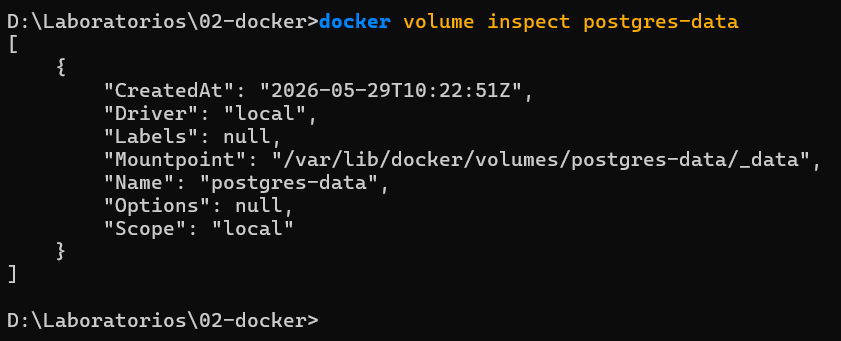


# tarea 6. Creando redes privadas

# 1. Crea una red llamada:my-net
 ``` docker network create my-net ```
 
# 2. Arranca dos contenedores ubuntu en esa red.
```
docker run -dit --name ubuntu1 --network my-net ubuntu

docker run -dit --name ubuntu2 --network my-net ubuntu
```

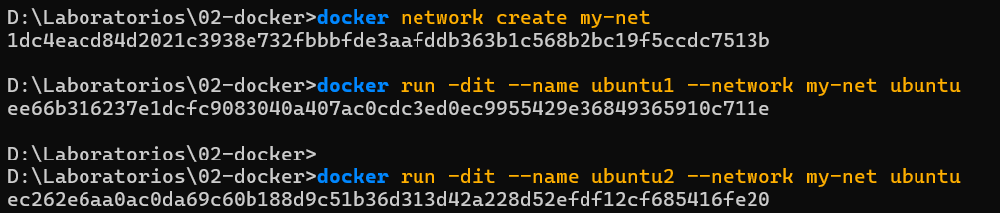

# 3. Instala ping si es necesario. 
```
docker exec -it ubuntu1 bash
apt-get update
apt-get install -y iputils-ping
```
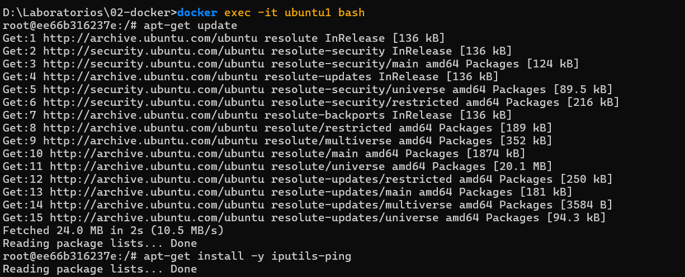


# 4. Desde un contenedor intenta hacer: ping otro_contenedor

```
ping ubuntu2
```

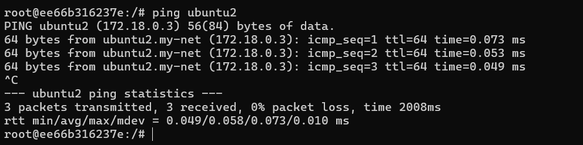

 
# Pregunta ¿Los contenedores pueden comunicarse entre sí?

Sí, los contenedores se comunican entre sí, pero su comportamiento cambia según la red:
En la red por defecto (bridge): Se comunican solo por dirección IP (ej. 172.17.0.2). El problema es que si el contenedor se reinicia, la IP cambia y la conexión se rompe.

En una red personalizada (ej. my-net): Es la opción profesional. Docker activa un DNS interno que permite a los contenedores comunicarse usando directamente su nombre (ej. ping ubuntu1). Las IPs pueden cambiar, pero el nombre siempre funcionará.

En redes diferentes: Existe un aislamiento total. Los contenedores no pueden hablar entre sí bajo ninguna circunstancia, garantizando la seguridad entre entornos.


root@ee66b316237e:/# ping ubuntu2
PING ubuntu2 (172.18.0.3) 56(84) bytes of data.
64 bytes from ubuntu2.my-net (172.18.0.3): icmp_seq=1 ttl=64 time=0.073 ms
64 bytes from ubuntu2.my-net (172.18.0.3): icmp_seq=2 ttl=64 time=0.053 ms
64 bytes from ubuntu2.my-net (172.18.0.3): icmp_seq=3 ttl=64 time=0.049 ms


Tambien se puede hacer con la ip por supuesto 
ping 172.18.0.3

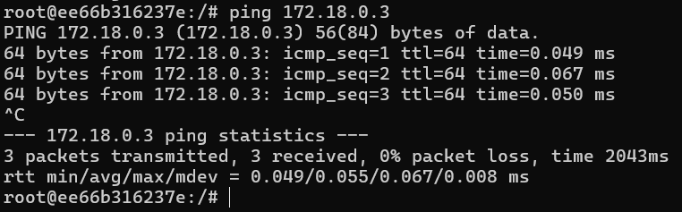


# tarea 7. Red none


 Investiga: ¿Para qué serviría ejecutar un contenedor con red: none

docker run -it --network none ubuntu

Una red de tipo none (o --network none) sirve para aislar por completo un contenedor del mundo exterior y de otros contenedores.

Al usar esta red, Docker levanta el contenedor sin una interfaz de red externa (no tiene eth0). Solo cuenta con la interfaz de bucle local (localhost o 127.0.0.1), por lo que no puede recibir tráfico de internet, no puede salir a internet y tampoco puede hablar con ningún otro contenedor de tu máquina.
Los 3 casos de uso principales

Aunque parezca contradictorio querer un contenedor sin red, en ingeniería de software es una herramienta clave para tareas de alta seguridad y computación pura:

1. Procesamiento de datos ultra seguros (Criptografía y Finanzas)
Si necesitas ejecutar un script que firme llaves criptográficas, genere tokens de seguridad o procese contraseñas maestras, la red none te garantiza que ningún proceso malicioso podrá "filtrar" o enviar esos datos confidenciales hacia un servidor externo.

2. Ejecución de código de terceros (Sandboxing / Entorno de pruebas)
Si estás construyendo una plataforma donde los usuarios suben su propio código para ser evaluado (como LeetCode o sistemas de exámenes de programación), ejecutar esos programas con --network none evita que un código malicioso intente hackear servidores externos, hacer ataques DDoS o descargar virus.

3. tareas pesadas de cálculo puro (Batch Processing)
Para contenedores que solo necesitan potencia de cómputo (por ejemplo, renderizar un video 3D con Blender, procesar un archivo de texto gigantesco que ya está guardado en un volumen, o ejecutar simulaciones matemáticas). Al quitarle la red, el contenedor no gasta memoria ni recursos del sistema gestionando conexiones.


# tarea 8. Multi-network
## 1. Crea dos redes: secure-zone public-zone 


```
docker network create secure-zone
docker network create public-zone
```

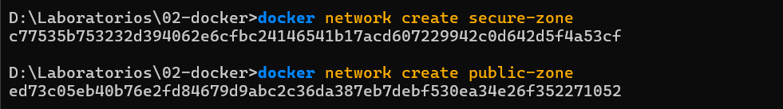


## 2. Arranca un contenedor en public-zone. 

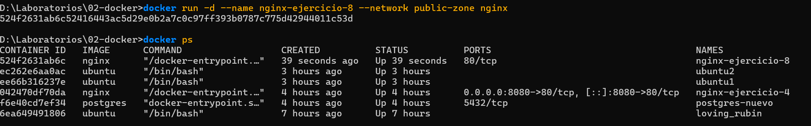

## 3. Pregunta: ¿Puedes conectarlo también a secure-zone? 
Sí, absolutamente. Una de las grandes ventajas de Docker es que un contenedor puede estar conectado a múltiples redes al mismo tiempo. 


## 4. ¿Qué comando usarías?
```
docker network connect secure-zone nginx-ejercicio-8
```

## 5. Comprobación

```
docker network inspect secure-zone
```

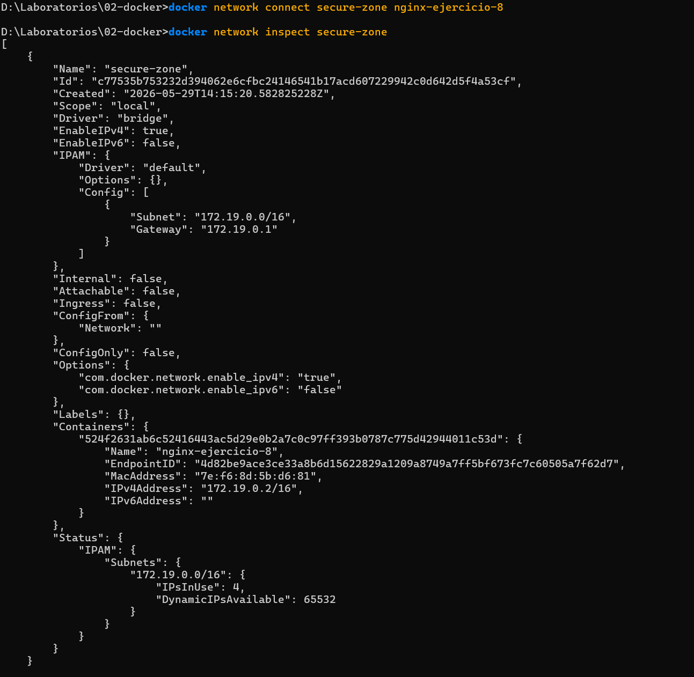
inspeccionar configuracion de red del contenedor


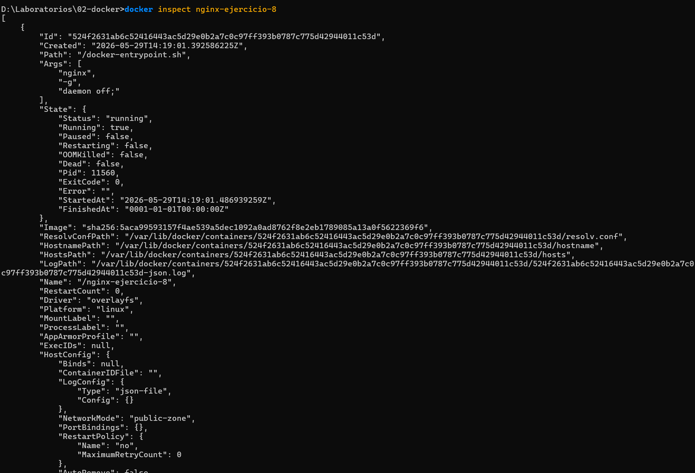


# tarea 9. Docker Compose --- Compartiendo volúmenes 

## 1. Crea un fichero docker-compose.yml  

Con dos servicios. 

Servicio Writer: 
• montar un volumen en /app/logs 
• escribir un timestamp cada 30 segundos 

Servicio Reader:
• montar el volumen en modo solo lectura 
• mostrar el contenido en consola

Este es el archivo que debemos lanzar 

```
version: '3.8'

services:
  writer:
    image: ubuntu
    volumes:
      - logs-data:/app/logs
    command: >
      bash -c "while true; do date >> /app/logs/log.txt; sleep 30; done"

  reader:
    image: ubuntu
    volumes:
      - logs-data:/app/logs:ro
    command: >
      bash -c "tail -f /app/logs/log.txt"

volumes:
  logs-data: {}

```
Este docker-compose.yml define un entorno con dos contenedores que comparten la misma información a través de un volumen común llamado logs-data.

1. El Volumen Compartido (logs-data)
Se crea un espacio de almacenamiento unificado en tu disco duro gestionado por Docker. Ambos contenedores lo montan en su carpeta interna /app/logs.

2. Los Servicios (Contenedores)
writer (El Escritor): * Usa una imagen de Ubuntu.
Acción: Ejecuta un bucle infinito que escribe la fecha y hora actual (date) dentro del archivo /app/logs/log.txt cada 30 segundos.
Permisos: Tiene acceso total de lectura y escritura sobre el volumen.

reader (El Lector):
Usa la misma imagen de Ubuntu.
Acción: Ejecuta el comando tail -f, lo que significa que se queda escuchando y mostrando en tiempo real en la pantalla todo lo que se escriba en /app/logs/log.txt.
Permisos: Lo monta en modo ro (Read-Only / Solo Lectura). Protege el archivo para que este contenedor no pueda modificarlo ni borrarlo por accidente.

En resumen: Es el clásico patrón Productor-Consumidor. Un contenedor genera datos constantemente en un archivo y el otro los lee en tiempo real de forma segura.


## 2. Lo ejecuto 
```
docker compose up
```

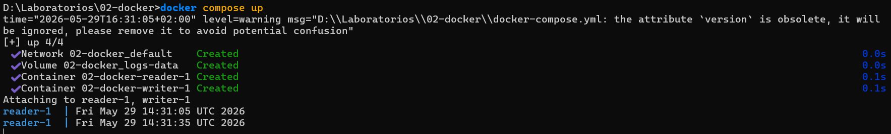


# tarea 10. Docker Compose Profiles 

# docker-compose.yml 
Crea un docker-compose.yml con:
    • postgres
    • pgadmin
Haz que pgadmin pueda conectarse a postgres.

'''
services:
  postgres:
    image: postgres
    container_name: postgres-db
    environment:
      POSTGRES_USER: admin
      POSTGRES_PASSWORD: admin
      POSTGRES_DB: testdb
    volumes:
      - pgdata:/var/lib/postgresql
    ports:
      - "5432:5432"

  pgadmin:
    image: dpage/pgadmin4
    container_name: pgadmin
    profiles:
      - completo
    environment:
      PGADMIN_DEFAULT_EMAIL: admin@admin.com
      PGADMIN_DEFAULT_PASSWORD: admin
    ports:
      - "8080:80"
    depends_on:
      - postgres

volumes:
  pgdata: {}
'''
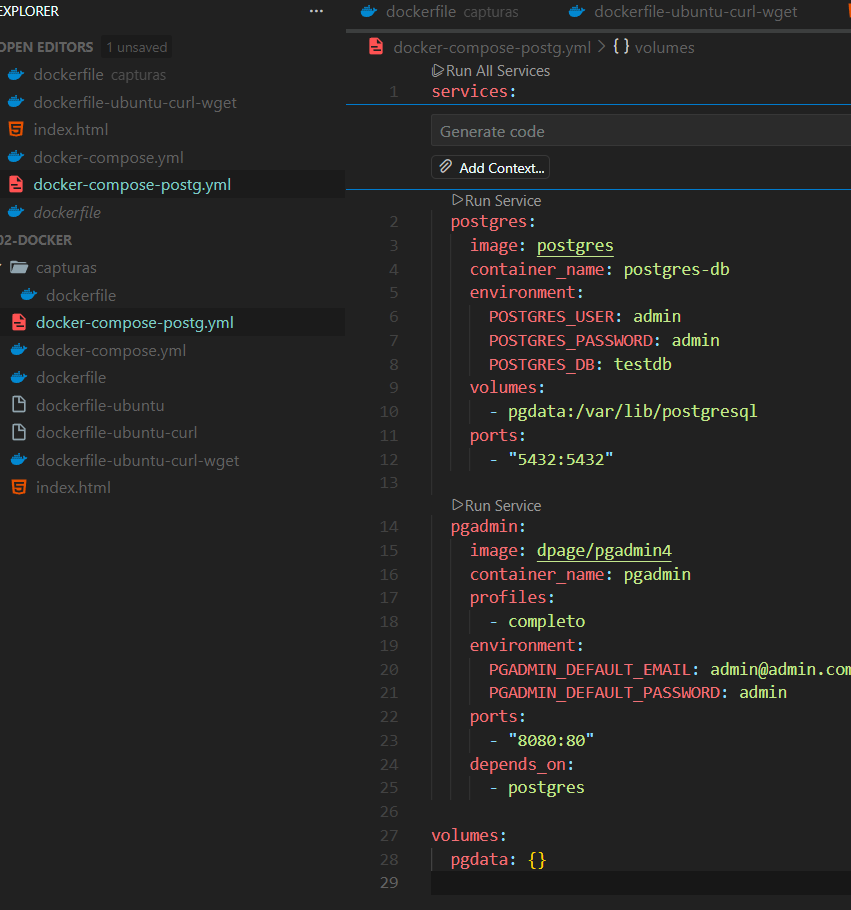


# Crea dos perfiles:
Perfil completo Levanta:
    • postgres
    • pgadmin
Este docker-compose.yml levanta un entorno clásico de base de datos con su interfaz gráfica de administración, pero introduce un concepto avanzado de control: los profiles (perfiles). 

1. El motor de Base de Datos (postgres)
Versión 18+ Lista: Aplica la buena práctica que descubrimos antes; monta el volumen pgdata directamente en la raíz /var/lib/postgresql.
Configuración: Inicializa el motor con un usuario (admin), contraseña (admin) y crea una base de datos llamada testdb.
Puertos: Expone el puerto 5432 hacia tu máquina local.

2. La interfaz web de administración (pgadmin)
Acceso: Te permite gestionar la base de datos visualmente desde el navegador entrando a http://localhost:8008 (con las credenciales admin@admin.com / admin).
Dependencia (depends_on): Docker Compose se asegura de arrancar primero el contenedor de postgres antes de intentar encender pgadmin.

3. La clave del archivo: El truco de profiles 🌟
El parámetro profiles: - completo bajo el servicio pgadmin cambia por completo las reglas de ejecución:
Si ejecutas docker compose up -d: Solo arrancará Postgres. Docker ignorará por completo a pgadmin porque tiene un perfil asignado. Esto es ideal para ahorrar RAM en tu PC cuando solo necesitas el motor de base de datos y no la interfaz gráfica.
Si quieres arrancar ambos contenedores: Debes llamar explícitamente al perfil en tu terminal usando el parámetro --profile:

Si queremos arrancar solo postgres
```
docker compose -f docker-compose.postg.yml up -d
```


Vamos a levantar perfil completo
```
docker compose -f docker-compose-postg.yml --profile completo up -d
```

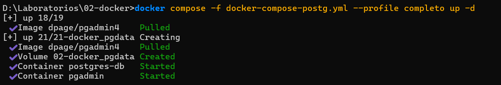


Entrar a pgAdmin

Abre:

http://localhost:8008


Login:
Email: admin@admin.com
Password: admin

Conectar pgAdmin a PostgreSQL

En pgAdmin, crea un servidor nuevo:

Host name/address: postgres
Port: 5432
Username: admin
Password: admin
Database: testdb


3. Apagar el entorno
Para detener los contenedores, la regla de oro es pasarle siempre el archivo con -f para que Docker sepa qué infraestructura debe destruir:
Si solo encendiste Postgres: docker compose -f docker-compose.postg.yml down
Si encendiste ambos con el perfil: docker compose -f docker-compose.postg.yml --profile completo down


